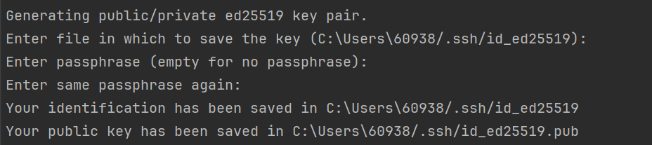

在使用 GitHub 时，我们需要一种安全的方式来连接和管理仓库。由于 GitHub 已经在 2021 年 8 月 13 日之后停止支持密码认证，**使用 SSH Keys 进行认证**就成为了一种更合理的实践。本文会一步一步带你完成 SSH key 的生成、添加到 GitHub，以及最终的连接测试。

## 什么是 SSH Keys？

SSH keys 是一对密码学密钥，用于在连接远程服务器或 GitHub 这类服务时验证身份。它由两部分组成：

- **公钥（public key）**：可以安全地分享给服务端；
- **私钥（private key）**：必须保密，只能自己持有。

当你连接到服务端时，本地私钥会生成签名，而服务端会使用公钥来验证你的身份。

## Windows 上配置 SSH Keys 的步骤

### 第一步：生成 SSH Key Pair

打开终端（PowerShell 或 Git Bash），执行下面的命令：

```bash
ssh-keygen -t ed25519 -C "your_email@example.com"
```

系统会询问你把密钥保存到哪里。直接按 `Enter` 使用默认路径即可。如果你想增加一层安全性，也可以设置 passphrase；如果不需要，留空即可（推荐）。



### 第二步：启动 SSH Agent，并把 SSH Key 加入 Agent

如果你希望 SSH key 能**自动被管理和使用**，就需要启动 SSH agent：

这里建议使用 **Git Bash**（而不是 IDE 内置终端或 PowerShell），然后执行：

```bash
eval "$(ssh-agent -s)"
ssh-add ~/.ssh/id_ed25519
```

### 第三步：把 SSH Public Key 添加到 GitHub

1. 先复制你的公钥内容：

   ```bash
   cat ~/.ssh/id_ed25519.pub
   ```

2. 打开你的 [GitHub SSH settings](https://github.com/settings/keys)，然后点击 **New SSH key**。

### 第四步：测试 SSH 连接

最后，我们需要确认配置是否成功。执行下面的命令（这一步在 IDE 终端中执行也可以）：

```bash
ssh -T git@github.com
```

根据提示继续操作，如果一切正常，你会看到连接成功的提示信息。


