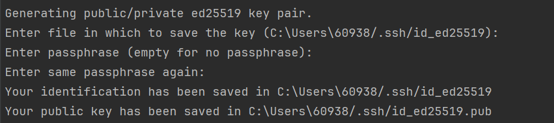

- [What Are SSH Keys?](#what-are-ssh-keys)
- [Step-by-Step Guide to Setting Up SSH Keys on Windows](#step-by-step-guide-to-setting-up-ssh-keys-on-windows)
  - [Step 1: Generate the SSH Key Pair](#step-1-generate-the-ssh-key-pair)
  - [Step 2: Start the SSH Agent and Add Your SSH Key to the Agent](#step-2-start-the-ssh-agent-and-add-your-ssh-key-to-the-agent)
  - [Step 3: Add Your SSH Key to GitHub](#step-3-add-your-ssh-key-to-github)
  - [Step 4: Test Your SSH Connection](#step-4-test-your-ssh-connection)

Working with GitHub requires a secure way to connect and manage your repositories, but GitHub will no longer support password authentication after August 13, 2021. Instead, **using SSH keys for authentication** seems to be a better practice. In this blog post, I’ll walk you through the process of setting up SSH keys, adding them to GitHub and so on.

## What Are SSH Keys?

SSH keys are a pair of cryptographic keys used to authenticate your identity when connecting to remote servers or services like GitHub. They consist of a **public key**, which you can share with others (or services), and a **private key**, which should be kept secret. When you connect to a server, your private key generates a signature that the server checks using your public key to verify your identity.

## Step-by-Step Guide to Setting Up SSH Keys on Windows

### Step 1: Generate the SSH Key Pair

Open your terminal (PowerShell or Git Bash) and run the following command:

```bash
ssh-keygen -t ed25519 -C "your_email@example.com"
```

You'll be asked where to save the key. Press `Enter` to accept the default location. If you want to add a passphrase for extra security, you can do so; otherwise, just leave it blank (Recommend).



### Step 2: Start the SSH Agent and Add Your SSH Key to the Agent

To manage your SSH keys **automatically**, you need to start the SSH agent:

You should open the **Git Bash** (not the terminal in IDE or PowerShell), and then run the following command:

```bash
eval "$(ssh-agent -s)"
ssh-add ~/.ssh/id_ed25519
```

### Step 3: Add Your SSH Key to GitHub

1. Copy your public key to the clipboard:

   ```bash
   cat ~/.ssh/id_ed25519.pub
   ```

2. Go to your [GitHub SSH settings](https://github.com/settings/keys) and **New your SSH key**.

### Step 4: Test Your SSH Connection

Finally, let's make sure everything is set up correctly. Run the following command (In the IDE terminal is OK) to test the connection:

```bash
ssh -T git@github.com
```

Follow the prompt and you will see the message showing the connection is successful.


