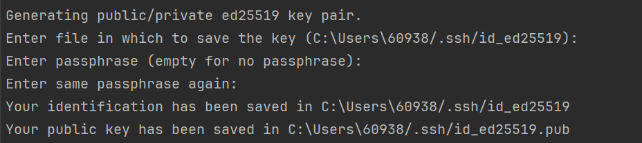

GitHub does not accept account passwords for Git operations over HTTPS. HTTPS can use a token or a credential manager; **SSH uses a key pair**. These are separate from signing in to the GitHub website. This post follows the SSH route on Windows with Git Bash, from generating a key to adding it to GitHub and testing the connection. GitHub documents these options in its [authentication guide](https://docs.github.com/en/authentication/keeping-your-account-and-data-secure/about-authentication-to-github).

## What Are SSH Keys?

SSH keys are a pair of cryptographic keys used to authenticate your identity when connecting to remote servers or services like GitHub. They consist of a **public key**, which you can share with others (or services), and a **private key**, which should be kept secret. When you connect to a server, your private key generates a signature that the server checks using your public key to verify your identity.

## Step-by-Step Guide to Setting Up SSH Keys on Windows

### Step 1: Generate the SSH Key Pair

Open Git Bash and run the following command:

```bash
ssh-keygen -t ed25519 -C "your_email@example.com"
```

When asked where to save the key, accept the default only if it will not overwrite an existing key. Otherwise, choose another filename and use that path in the commands below. Set a strong passphrase to protect the private key; ssh-agent can keep it available during your session so you do not have to enter the passphrase for every operation. See GitHub's [key generation guide](https://docs.github.com/en/authentication/connecting-to-github-with-ssh/generating-a-new-ssh-key-and-adding-it-to-the-ssh-agent).



### Step 2: Start the SSH Agent and Add Your SSH Key to the Agent

To manage your SSH keys **automatically**, you need to start the SSH agent:

Continue in the same **Git Bash** session. These commands use Bash syntax; PowerShell and the Windows OpenSSH agent require a different setup.

```bash
eval "$(ssh-agent -s)"
ssh-add ~/.ssh/id_ed25519
```

### Step 3: Add Your SSH Key to GitHub

1. Display your public key, then copy the output. Do not copy or upload the private key:

   ```bash
   cat ~/.ssh/id_ed25519.pub
   ```

2. Go to your [GitHub SSH settings](https://github.com/settings/keys), select **New SSH key**, choose **Authentication Key**, and paste the public key.

### Step 4: Test Your SSH Connection

Run the following command in the same Git Bash session to test the connection:

```bash
ssh -T git@github.com
```

On the first connection, compare the host fingerprint with [GitHub's published fingerprints](https://docs.github.com/en/authentication/keeping-your-account-and-data-secure/githubs-ssh-key-fingerprints) before accepting it. A successful test says you have authenticated but GitHub does not provide shell access; the [connection test documentation](https://docs.github.com/en/authentication/connecting-to-github-with-ssh/testing-your-ssh-connection) notes that this command exits with status 1 even on success.


